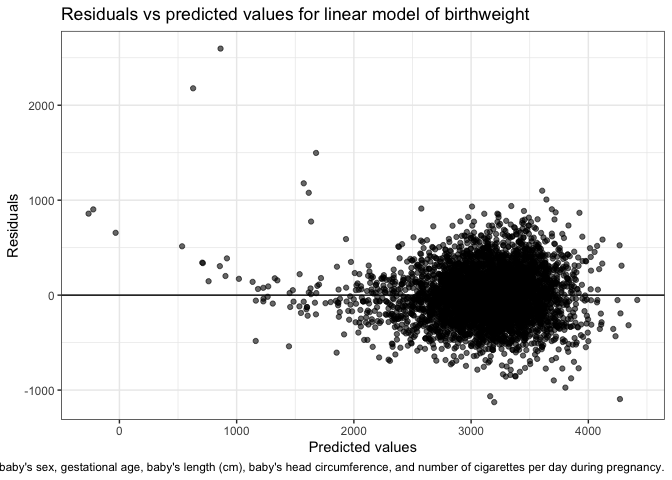
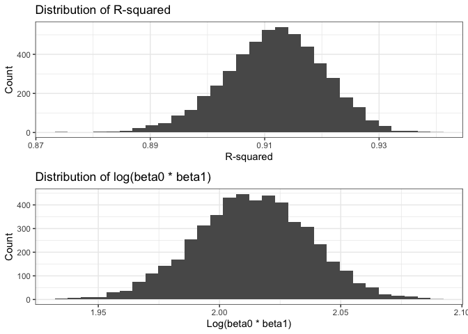

Homework 6: Linear Models
================
Jessica Lavery
Due 11/25/2019

# Problem 1

``` r
# read in and tidy the data
raw_data <- read_csv("./data/birthweight.csv") %>% 
  janitor::clean_names() 
```

    ## Parsed with column specification:
    ## cols(
    ##   .default = col_double()
    ## )

    ## See spec(...) for full column specifications.

``` r
tidy_data <- raw_data %>% 
  mutate(babysex = factor(case_when(babysex == 1 ~ "Male",
                             babysex == 2 ~ "Female"), levels = c("Male", "Female")),
         father_race = fct_reorder(as_factor(case_when(frace == 1 ~ "White",
                           frace == 2 ~ "Black",
                           frace == 3 ~ "Asian",
                           frace == 4 ~ "Puerto Rican",
                           frace == 8 ~ "Other",
                           TRUE ~ as.character(NA))),  frace),
         mother_race = fct_reorder(as_factor(case_when(frace == 1 ~ "White",
                           frace == 2 ~ "Black",
                           frace == 3 ~ "Asian",
                           frace == 4 ~ "Puerto Rican",
                           frace == 8 ~ "Other",
                           TRUE ~ as.character(NA))),  mrace))
```

Since we are going to be fitting a model we will start by looking at a
summary of the data. In particular we will look at the amount of
missingness and the levels of each variable.

``` r
skimr::skim(tidy_data)
```

    ## Skim summary statistics
    ##  n obs: 4342 
    ##  n variables: 22 
    ## 
    ## ── Variable type:factor ───────────────────────────────────────────────────────────────────
    ##     variable missing complete    n n_unique
    ##      babysex       0     4342 4342        2
    ##  father_race       0     4342 4342        5
    ##  mother_race       0     4342 4342        5
    ##                               top_counts ordered
    ##              Mal: 2230, Fem: 2112, NA: 0   FALSE
    ##  Whi: 2123, Bla: 1911, Pue: 248, Asi: 46   FALSE
    ##  Whi: 2123, Bla: 1911, Pue: 248, Asi: 46   FALSE
    ## 
    ## ── Variable type:numeric ──────────────────────────────────────────────────────────────────
    ##  variable missing complete    n      mean      sd     p0     p25     p50
    ##     bhead       0     4342 4342   33.65     1.62   21      33      34   
    ##   blength       0     4342 4342   49.75     2.72   20      48      50   
    ##       bwt       0     4342 4342 3114.4    512.15  595    2807    3132.5 
    ##     delwt       0     4342 4342  145.57    22.21   86     131     143   
    ##   fincome       0     4342 4342   44.11    25.98    0      25      35   
    ##     frace       0     4342 4342    1.66     0.85    1       1       2   
    ##   gaweeks       0     4342 4342   39.43     3.15   17.7    38.3    39.9 
    ##   malform       0     4342 4342    0.0035   0.059   0       0       0   
    ##  menarche       0     4342 4342   12.51     1.48    0      12      12   
    ##   mheight       0     4342 4342   63.49     2.66   48      62      63   
    ##    momage       0     4342 4342   20.3      3.88   12      18      20   
    ##     mrace       0     4342 4342    1.63     0.77    1       1       2   
    ##    parity       0     4342 4342    0.0023   0.1     0       0       0   
    ##   pnumlbw       0     4342 4342    0        0       0       0       0   
    ##   pnumsga       0     4342 4342    0        0       0       0       0   
    ##     ppbmi       0     4342 4342   21.57     3.18   13.07   19.53   21.03
    ##      ppwt       0     4342 4342  123.49    20.16   70     110     120   
    ##    smoken       0     4342 4342    4.15     7.41    0       0       0   
    ##    wtgain       0     4342 4342   22.08    10.94  -46      15      22   
    ##      p75   p100     hist
    ##    35      41   ▁▁▁▁▅▇▁▁
    ##    51      63   ▁▁▁▁▁▇▁▁
    ##  3459    4791   ▁▁▁▃▇▇▂▁
    ##   157     334   ▁▇▅▁▁▁▁▁
    ##    65      96   ▁▂▇▂▂▂▁▃
    ##     2       8   ▇▇▁▁▁▁▁▁
    ##    41.1    51.3 ▁▁▁▁▃▇▁▁
    ##     0       1   ▇▁▁▁▁▁▁▁
    ##    13      19   ▁▁▁▁▂▇▁▁
    ##    65      77   ▁▁▁▅▇▂▁▁
    ##    22      44   ▂▇▅▂▁▁▁▁
    ##     2       4   ▇▁▇▁▁▁▁▁
    ##     0       6   ▇▁▁▁▁▁▁▁
    ##     0       0   ▁▁▁▇▁▁▁▁
    ##     0       0   ▁▁▁▇▁▁▁▁
    ##    22.91   46.1 ▁▇▅▁▁▁▁▁
    ##   134     287   ▁▇▆▁▁▁▁▁
    ##     5      60   ▇▁▁▁▁▁▁▁
    ##    28      89   ▁▁▁▇▇▁▁▁

Before fitting a linear model we will plot the distribution of
birthweight to ensure that a linear model is appropriate. Based on the
below histogram, the data are normally distributed and a linear model is
appropriate for the outcome of birthweight.

``` r
# plot the raw birthweight data
ggplot(data = tidy_data, aes(x = bwt)) +
  geom_histogram()
```

    ## `stat_bin()` using `bins = 30`. Pick better value with `binwidth`.

<!-- -->

The following linear modoel is based on pre-specification of the
relevant covariates a priori.

``` r
tidy_data %>% 
  select_if(is.factor) %>% 
  map(table, useNA = "always")
```

    ## $babysex
    ## 
    ##   Male Female   <NA> 
    ##   2230   2112      0 
    ## 
    ## $father_race
    ## 
    ##        White        Black        Asian Puerto Rican        Other 
    ##         2123         1911           46          248           14 
    ##         <NA> 
    ##            0 
    ## 
    ## $mother_race
    ## 
    ##        White        Other        Black        Asian Puerto Rican 
    ##         2123           14         1911           46          248 
    ##         <NA> 
    ##            0

Variables that were selected were variables that are hypothesized to be
related to birthweight. Binary or categorical covariates with small cell
sizes were not included in the model since they would advsersely affect
model fit. Examples of such variables that were considered but not
included due to low cell counts were: `malform` (n=15), `pnumsga` (n=0).

``` r
# propose a linear model for the data
mdl_bwt <- lm(bwt ~ babysex + gaweeks, data = tidy_data)
#+  delwt +  + ppbmi + wtgain
broom::tidy(mdl_bwt)
```

    ## # A tibble: 3 x 5
    ##   term          estimate std.error statistic   p.value
    ##   <chr>            <dbl>     <dbl>     <dbl>     <dbl>
    ## 1 (Intercept)      511.      88.5       5.78 8.19e-  9
    ## 2 babysexFemale    -97.4     14.1      -6.91 5.70e- 12
    ## 3 gaweeks           67.2      2.23     30.1  6.64e-181

## Residuals vs predicted values

``` r
tidy_data %>% 
  modelr::add_residuals(mdl_bwt) %>% 
  modelr::add_predictions(mdl_bwt) %>% 
  ggplot(aes(x = pred, y = resid)) + 
  geom_point() + 
  geom_smooth(method = "loess", se = TRUE) + 
  labs(title = "Residuals vs predicted values for linear model of birthweight",
       caption = "Model adjusted for: baby's sex, mother's delivery weight, gestational age (weeks), pre-pregnancy BMI, and weight gain.",
       x = "Predicted values",
       y = "Residuals")
```

<!-- -->

## Model comparisons

``` r
alt_model1 <- lm(bwt ~ blength + gaweeks, data = tidy_data)

alt_model2 <- lm(bwt ~ bhead + blength + babysex + bhead*blength + bhead*babysex + blength*babysex + bhead*blength*babysex, data = tidy_data)
```

# Problem 2

``` r
# read in raw data
weather_df <- 
  rnoaa::meteo_pull_monitors(
    c("USW00094728"),
    var = c("PRCP", "TMIN", "TMAX"),
    date_min = "2017-01-01",
    date_max = "2017-12-31") %>%
  mutate(name = recode(id, USW00094728 = "CentralPark_NY"),
         tmin = tmin / 10,
         tmax = tmax / 10) %>%
  select(name, id, everything())
```

    ## Registered S3 method overwritten by 'crul':
    ##   method                 from
    ##   as.character.form_file httr

    ## Registered S3 method overwritten by 'hoardr':
    ##   method           from
    ##   print.cache_info httr

    ## file path:          /Users/jessica/Library/Caches/rnoaa/ghcnd/USW00094728.dly

    ## file last updated:  2019-09-26 10:27:16

    ## file min/max dates: 1869-01-01 / 2019-09-30

## Bootstrap

``` r
# 1. select bootstrap samples
bootstrap_samples <- weather_df %>% 
  modelr::bootstrap(n = 1000)

# 2. on each bootstrapped sample, run a linear model and extract relevant information 
bootstrap_models <- bootstrap_samples %>% 
  mutate(models = map(strap, ~lm(tmax ~ tmin, data = .x)),
         results = map(models, broom::tidy),
         r2 = map(models, broom::glance)) %>% 
  select(-strap, -models) %>%
  unnest(c(results, r2), names_repair = "universal") %>% 
  select(.id, term, estimate, r.squared) %>% 
  pivot_wider(id_cols = c(.id, r.squared),
              names_from = term,
              values_from = estimate) %>% 
  rename(beta0 = `(Intercept)`, beta1 = "tmin") %>% 
  mutate(logb0b1 = log(beta0 * beta1)) 
```

    ## New names:
    ## * statistic -> statistic...5
    ## * p.value -> p.value...6
    ## * statistic -> statistic...10
    ## * p.value -> p.value...11

``` r
head(bootstrap_models)
```

    ## # A tibble: 6 x 5
    ##   .id   r.squared beta0 beta1 logb0b1
    ##   <chr>     <dbl> <dbl> <dbl>   <dbl>
    ## 1 0001      0.929  6.98  1.04    1.99
    ## 2 0002      0.901  7.20  1.02    2.00
    ## 3 0003      0.906  7.41  1.04    2.04
    ## 4 0004      0.900  7.27  1.04    2.02
    ## 5 0005      0.896  7.30  1.04    2.03
    ## 6 0006      0.910  7.15  1.04    2.00

``` r
# 3. plot the distribution of the estimates of interest
dist_r2 <- ggplot(data = bootstrap_models, aes(x = r.squared)) + 
  geom_histogram() +
  labs(x = "R-squared",
       y = "Count",
       title = "Distribution of R-squared")

dist_logb0b1 <- ggplot(data = bootstrap_models, aes(x = logb0b1)) + 
  geom_histogram() +
  labs(x = "Log(beta0 * beta1)",
       y = "Count",
       title = "Distribution of log(beta0 * beta1)")

dist_r2 / dist_logb0b1
```

    ## `stat_bin()` using `bins = 30`. Pick better value with `binwidth`.

    ## `stat_bin()` using `bins = 30`. Pick better value with `binwidth`.

<!-- -->

``` r
#4. summarize bootstrapped reuslts
bootstrap_summary <- bootstrap_models %>% 
  summarize(r2_lower = round(quantile(r.squared, probs = 0.025), 3),
         r2_upper = round(quantile(r.squared, probs = 0.975), 3),
         logb0b1_lower = round(quantile(logb0b1, probs = 0.025), 3),
         logb0b1_upper = round(quantile(logb0b1, probs = 0.975), 3)) 
```

The 95% CI for the r-squared value is (0.893, 0.929).

The 95% CI for log(b0 \* b1) is (1.967, 2.057).
