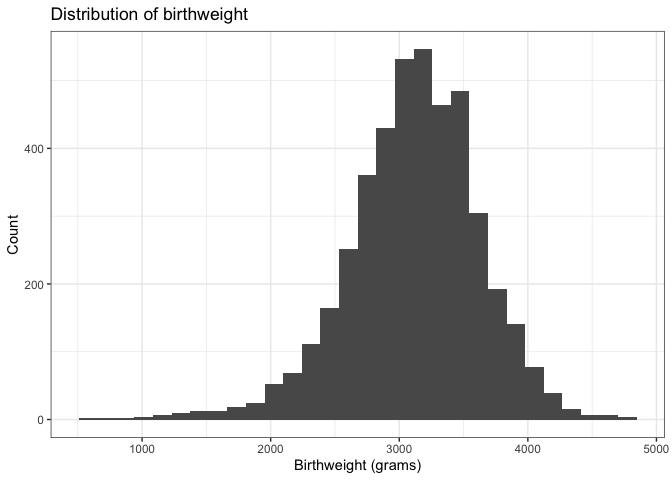
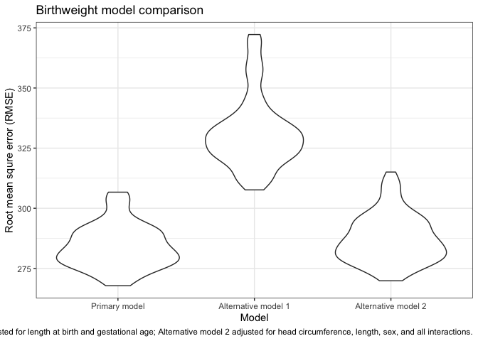

Homework 6: Linear Models
================
Jessica Lavery
Due 11/25/2019

# Problem 1

``` r
# read in and tidy the data
raw_data <- read_csv("./data/birthweight.csv") %>% 
  janitor::clean_names() 
```

    ## Parsed with column specification:
    ## cols(
    ##   .default = col_double()
    ## )

    ## See spec(...) for full column specifications.

``` r
tidy_data <- raw_data %>% 
  mutate(babysex = factor(case_when(babysex == 1 ~ "Male",
                             babysex == 2 ~ "Female"), levels = c("Male", "Female")),
         father_race = fct_reorder(as_factor(case_when(frace == 1 ~ "White",
                           frace == 2 ~ "Black",
                           frace == 3 ~ "Asian",
                           frace == 4 ~ "Puerto Rican",
                           frace == 8 ~ "Other",
                           TRUE ~ as.character(NA))),  frace),
         mother_race = fct_reorder(as_factor(case_when(frace == 1 ~ "White",
                           frace == 2 ~ "Black",
                           frace == 3 ~ "Asian",
                           frace == 4 ~ "Puerto Rican",
                           frace == 8 ~ "Other",
                           TRUE ~ as.character(NA))),  mrace))
```

Since we are going to be fitting a model we will start by looking at a
summary of the data. In particular we will look at the amount of
missingness and the levels of each variable.

``` r
skimr::skim(tidy_data)
```

    ## Skim summary statistics
    ##  n obs: 4342 
    ##  n variables: 22 
    ## 
    ## ── Variable type:factor ──────────────────────────────────────────────────────────────────────────────────────────────────────────────────────────────
    ##     variable missing complete    n n_unique
    ##      babysex       0     4342 4342        2
    ##  father_race       0     4342 4342        5
    ##  mother_race       0     4342 4342        5
    ##                               top_counts ordered
    ##              Mal: 2230, Fem: 2112, NA: 0   FALSE
    ##  Whi: 2123, Bla: 1911, Pue: 248, Asi: 46   FALSE
    ##  Whi: 2123, Bla: 1911, Pue: 248, Asi: 46   FALSE
    ## 
    ## ── Variable type:numeric ─────────────────────────────────────────────────────────────────────────────────────────────────────────────────────────────
    ##  variable missing complete    n      mean      sd     p0     p25     p50
    ##     bhead       0     4342 4342   33.65     1.62   21      33      34   
    ##   blength       0     4342 4342   49.75     2.72   20      48      50   
    ##       bwt       0     4342 4342 3114.4    512.15  595    2807    3132.5 
    ##     delwt       0     4342 4342  145.57    22.21   86     131     143   
    ##   fincome       0     4342 4342   44.11    25.98    0      25      35   
    ##     frace       0     4342 4342    1.66     0.85    1       1       2   
    ##   gaweeks       0     4342 4342   39.43     3.15   17.7    38.3    39.9 
    ##   malform       0     4342 4342    0.0035   0.059   0       0       0   
    ##  menarche       0     4342 4342   12.51     1.48    0      12      12   
    ##   mheight       0     4342 4342   63.49     2.66   48      62      63   
    ##    momage       0     4342 4342   20.3      3.88   12      18      20   
    ##     mrace       0     4342 4342    1.63     0.77    1       1       2   
    ##    parity       0     4342 4342    0.0023   0.1     0       0       0   
    ##   pnumlbw       0     4342 4342    0        0       0       0       0   
    ##   pnumsga       0     4342 4342    0        0       0       0       0   
    ##     ppbmi       0     4342 4342   21.57     3.18   13.07   19.53   21.03
    ##      ppwt       0     4342 4342  123.49    20.16   70     110     120   
    ##    smoken       0     4342 4342    4.15     7.41    0       0       0   
    ##    wtgain       0     4342 4342   22.08    10.94  -46      15      22   
    ##      p75   p100     hist
    ##    35      41   ▁▁▁▁▅▇▁▁
    ##    51      63   ▁▁▁▁▁▇▁▁
    ##  3459    4791   ▁▁▁▃▇▇▂▁
    ##   157     334   ▁▇▅▁▁▁▁▁
    ##    65      96   ▁▂▇▂▂▂▁▃
    ##     2       8   ▇▇▁▁▁▁▁▁
    ##    41.1    51.3 ▁▁▁▁▃▇▁▁
    ##     0       1   ▇▁▁▁▁▁▁▁
    ##    13      19   ▁▁▁▁▂▇▁▁
    ##    65      77   ▁▁▁▅▇▂▁▁
    ##    22      44   ▂▇▅▂▁▁▁▁
    ##     2       4   ▇▁▇▁▁▁▁▁
    ##     0       6   ▇▁▁▁▁▁▁▁
    ##     0       0   ▁▁▁▇▁▁▁▁
    ##     0       0   ▁▁▁▇▁▁▁▁
    ##    22.91   46.1 ▁▇▅▁▁▁▁▁
    ##   134     287   ▁▇▆▁▁▁▁▁
    ##     5      60   ▇▁▁▁▁▁▁▁
    ##    28      89   ▁▁▁▇▇▁▁▁

Before fitting a linear model we will plot the distribution of
birthweight to ensure that a linear model is appropriate. Based on the
below histogram, the data are normally distributed with mean 3114 grams
and a linear model is appropriate for the outcome of birthweight.

``` r
# plot the raw birthweight data
ggplot(data = tidy_data, aes(x = bwt)) +
  geom_histogram() +
  labs(x = "Birthweight (grams)",
       y = "Count",
       title = "Distribution of birthweight")
```

    ## `stat_bin()` using `bins = 30`. Pick better value with `binwidth`.

<!-- -->

The following linear model is based on pre-specification of the relevant
covariates a priori, meaning tht variables included were variables that
are hypothesized to be related to birthweight rather than model
selection via data driven approach. Binary or categorical covariates
with small cell sizes were not included in the model since they would
advsersely affect model fit. Examples of such variables that were
considered but not included due to low cell counts or fewer than two
levels were: `malform` (n=15), `pnumsga` (n=0).

``` r
# propose a linear model for the data
mdl_bwt <- lm(bwt ~ babysex + gaweeks + blength + bhead + smoken, data = tidy_data)

broom::tidy(mdl_bwt) %>% 
  mutate(p_value = format.pval(p.value, digits = 2, eps = 0.001)) %>% 
  select(-p.value) %>% 
  kable()
```

<table>

<thead>

<tr>

<th style="text-align:left;">

term

</th>

<th style="text-align:right;">

estimate

</th>

<th style="text-align:right;">

std.error

</th>

<th style="text-align:right;">

statistic

</th>

<th style="text-align:left;">

p\_value

</th>

</tr>

</thead>

<tbody>

<tr>

<td style="text-align:left;">

(Intercept)

</td>

<td style="text-align:right;">

\-6239.757901

</td>

<td style="text-align:right;">

98.1459977

</td>

<td style="text-align:right;">

\-63.576285

</td>

<td style="text-align:left;">

\<0.001

</td>

</tr>

<tr>

<td style="text-align:left;">

babysexFemale

</td>

<td style="text-align:right;">

32.245881

</td>

<td style="text-align:right;">

8.8399223

</td>

<td style="text-align:right;">

3.647756

</td>

<td style="text-align:left;">

\<0.001

</td>

</tr>

<tr>

<td style="text-align:left;">

gaweeks

</td>

<td style="text-align:right;">

14.399842

</td>

<td style="text-align:right;">

1.5156942

</td>

<td style="text-align:right;">

9.500493

</td>

<td style="text-align:left;">

\<0.001

</td>

</tr>

<tr>

<td style="text-align:left;">

blength

</td>

<td style="text-align:right;">

81.426457

</td>

<td style="text-align:right;">

2.0819313

</td>

<td style="text-align:right;">

39.111021

</td>

<td style="text-align:left;">

\<0.001

</td>

</tr>

<tr>

<td style="text-align:left;">

bhead

</td>

<td style="text-align:right;">

140.473722

</td>

<td style="text-align:right;">

3.5646540

</td>

<td style="text-align:right;">

39.407394

</td>

<td style="text-align:left;">

\<0.001

</td>

</tr>

<tr>

<td style="text-align:left;">

smoken

</td>

<td style="text-align:right;">

\-1.767918

</td>

<td style="text-align:right;">

0.5881574

</td>

<td style="text-align:right;">

\-3.005859

</td>

<td style="text-align:left;">

0.0027

</td>

</tr>

</tbody>

</table>

## Residuals vs predicted values

``` r
tidy_data %>% 
  add_residuals(mdl_bwt) %>% 
  add_predictions(mdl_bwt) %>% 
  # filter(pred > 0) %>% 
  ggplot(aes(x = pred, y = resid)) + 
  geom_point(alpha = 0.6) + 
  geom_hline(yintercept = 0) + 
  # geom_smooth(method = "loess", se = TRUE) + 
  labs(title = "Residuals vs predicted values for linear model of birthweight",
       caption = "Model adjusted for: baby's sex, gestational age, baby's length (cm), baby's head circumference, and number of cigarettes per day during pregnancy.",
       x = "Predicted values",
       y = "Residuals")
```

<!-- -->

There is are three babies whose predicted birthweight is less than 0,
but they are clear outliers in the data. For the majority of the data,
the residuals are generally evenly dispersed across the predicted
values.

## Model comparisons

``` r
# cross-validate to get standard errors for alt_model1
# generate test-training pairs for cross-validation
cv <- crossv_mc(tidy_data, 100) %>% 
  # format the cross validated datasets as tibbles
  mutate(train = map(train, as_tibble),
    test = map(test, as_tibble)) %>% 
  # run each of the models
  mutate(primary_model  = map(train, ~lm(bwt ~ babysex + gaweeks + blength + bhead + smoken, data = .x)),
         alt_model1  = map(train, ~lm(bwt ~ blength + gaweeks, data = .x)),
         alt_model2  = map(train, ~lm(bwt ~ bhead + blength + babysex + bhead*blength + bhead*babysex + blength*babysex + bhead*blength*babysex, data = .x))) %>% 
  # pull out root mses
  mutate(rmse_primary = map2_dbl(primary_model, test, ~rmse(model = .x, data = .y)),
         rmse_alt1 = map2_dbl(alt_model1, test, ~rmse(model = .x, data = .y)),
         rmse_alt2 = map2_dbl(alt_model2, test, ~rmse(model = .x, data = .y)))

# use ggplot to assess model fit
cv %>% 
  select(starts_with("rmse")) %>% 
  pivot_longer(everything(),
    names_to = "model", 
    values_to = "rmse",
    names_prefix = "rmse_") %>% 
  mutate(model = case_when(model == "primary" ~ "Primary model",
                           model == "alt1" ~ "Alternative model 1",
                           model == "alt2" ~ "Alternative model 2"),
         model = fct_inorder(model)) %>% 
  ggplot(aes(x = model, y = rmse)) + 
  geom_violin() +
  labs(title = "Birthweight model comparison",
       x = "Model",
       y = "Root mean squre error (RMSE)",
       caption = "Alternative model 1 adjusted for length at birth and gestational age; Alternative model 2 adjusted for head circumference, length, sex, and all interactions.")
```

<!-- -->

The first alternative model (adjusted only for length at birth and
gestational age) had the highest RMSE, indicating poorest predictive
value. THe primary model (adjusted for baby’s sex, gestational age,
baby’s length (cm), baby’s head circumference, and number of
cigarettes per day during pregnancy) and the second alternative model
(adjusted for head circumference, length, sex, and all interactions)
were comparable in terms of their RMSE, with the primary model having
slightly lower RMSE than the second alternative model.

# Problem 2

``` r
# read in raw data
weather_df <- rnoaa::meteo_pull_monitors(
    c("USW00094728"),
    var = c("PRCP", "TMIN", "TMAX"),
    date_min = "2017-01-01",
    date_max = "2017-12-31") %>%
  mutate(name = recode(id, USW00094728 = "CentralPark_NY"),
         tmin = tmin / 10,
         tmax = tmax / 10) %>%
  select(name, id, everything())
```

    ## Registered S3 method overwritten by 'crul':
    ##   method                 from
    ##   as.character.form_file httr

    ## Registered S3 method overwritten by 'hoardr':
    ##   method           from
    ##   print.cache_info httr

    ## file path:          /Users/jessica/Library/Caches/rnoaa/ghcnd/USW00094728.dly

    ## file last updated:  2019-09-26 10:27:16

    ## file min/max dates: 1869-01-01 / 2019-09-30

## Bootstrap

``` r
# 1. select bootstrap samples
bootstrap_samples <- weather_df %>% 
  modelr::bootstrap(n = 5000)

# 2. on each bootstrapped sample, run a linear model and extract relevant information 
bootstrap_models <- bootstrap_samples %>% 
  mutate(models = map(strap, ~lm(tmax ~ tmin, data = .x)),
         results = map(models, broom::tidy),
         r2 = map(models, broom::glance)) %>% 
  select(-strap, -models) %>%
  unnest(c(results, r2), names_repair = "universal") %>% 
  select(.id, term, estimate, r.squared) %>% 
  pivot_wider(id_cols = c(.id, r.squared),
              names_from = term,
              values_from = estimate) %>% 
  rename(beta0 = `(Intercept)`, beta1 = "tmin") %>% 
  mutate(logb0b1 = log(beta0 * beta1)) 

head(bootstrap_models)
```

    ## # A tibble: 6 x 5
    ##   .id   r.squared beta0 beta1 logb0b1
    ##   <chr>     <dbl> <dbl> <dbl>   <dbl>
    ## 1 0001      0.923  6.91  1.06    1.99
    ## 2 0002      0.927  6.86  1.07    1.99
    ## 3 0003      0.910  6.57  1.07    1.95
    ## 4 0004      0.902  7.63  1.02    2.06
    ## 5 0005      0.906  7.30  1.04    2.03
    ## 6 0006      0.925  6.83  1.07    1.99

``` r
# 3. plot the distribution of the estimates of interest
dist_r2 <- ggplot(data = bootstrap_models, aes(x = r.squared)) + 
  geom_histogram() +
  labs(x = "R-squared",
       y = "Count",
       title = "Distribution of R-squared")

dist_logb0b1 <- ggplot(data = bootstrap_models, aes(x = logb0b1)) + 
  geom_histogram() +
  labs(x = "Log(beta0 * beta1)",
       y = "Count",
       title = "Distribution of log(beta0 * beta1)")

dist_r2 / dist_logb0b1
```

<!-- -->

``` r
#4. summarize bootstrapped reuslts
bootstrap_summary <- bootstrap_models %>% 
  summarize(r2_mean = round(mean(r.squared), 2),
         r2_lower = round(quantile(r.squared, probs = 0.025), 2),
         r2_upper = round(quantile(r.squared, probs = 0.975), 2),
         logb0b1_mean = round(mean(logb0b1), 2),
         logb0b1_lower = round(quantile(logb0b1, probs = 0.025), 2),
         logb0b1_upper = round(quantile(logb0b1, probs = 0.975), 2)) 
```

R-squared is approximately normally distributed with mean 0.91. The 95%
CI for the r-squared value is (0.89, 0.93).

Log(beta0*beta1) is also normally distributed with mean 2.01. The 95% CI
for log(b0 * b1) is (1.97, 2.06).
